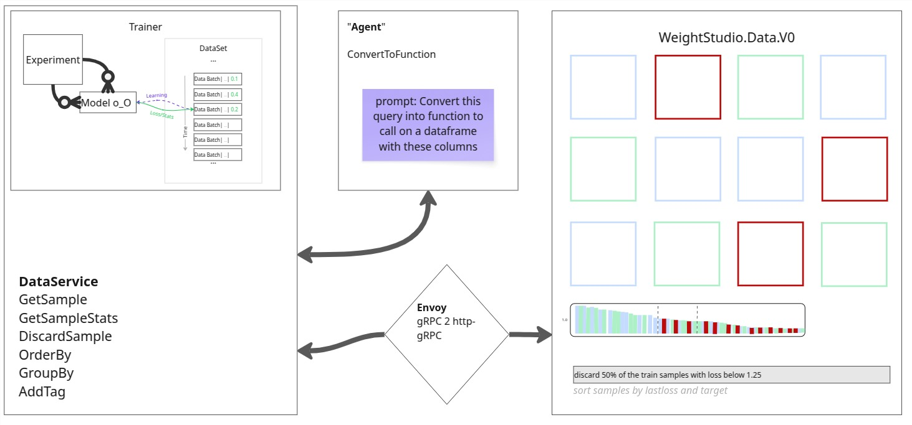

# WeightsLab UX

WeightsLab UX is the on-premise, data-facing frontend for the WeightsLab machine learning framework. It is a TypeScript-based application designed for visualizing datasets and interacting with ML experiments.

## Overview

This application serves as the primary user interface for exploring data, order, group, add slices and discard samples that are deemed unnecessary.



## Tech Stack

- **TypeScript**: Core language for development.
- **Vite**: Frontend tooling for development and builds.
- **Protocol Buffers / gRPC-web**: For type-safe API communication with the backend.

## Getting Started

### Prerequisites

- **Python 3.11**
- **Node.js** and **npm**
- **Docker** (for Envoy proxy)
- **Ollama** (for LLM capabilities) - [Download Ollama](https://ollama.com/) and ensure it's running.

### Installation & Setup

Follow these steps to set up the environment for both `weightslab` (backend) and `weights_studio` (frontend).

1. **Create and activate a virtual environment** (Python 3.11 required):
   ```bash
   # In the root of the repository
   python3.11 -m venv venv
   source venv/bin/activate
   ```

2. **Install Backend Dependencies**:
   Navigate to the `weightslab` directory.
   ```bash
   cd weightslab
   # git checkout dev  # Ensure you are on the correct branch
   pip install -r requirements.txt
   ```

3. **Install `weightslab` package in Editable Mode**:
   This allows the backend scripts to import `weightslab` modules.
   ```bash
   pip install --no-deps -e .
   ```

4. **Generate Protocol Buffers**:
   Navigate to the `weights_studio` directory and run the generation script. This generates both Python (backend) and TypeScript (frontend) proto files.
   ```bash
   cd ../weights_studio
   ./generate_protos.sh
   ```

5. **Install Ollama**:
    Download and install Ollama from https://ollama.com/download. 
    This works for macos and linux. For Windows please use WSL.

    Once installed, check: 
    ```bash
    ollama --version
    ```

    Then, pull the model:
    ```bash
    ollama pull llama3.2:1b
    ```


### Usage

You will need to run the following services simultaneously (e.g., in separate terminal tabs).

**1. Start Ollama**
Ensure Ollama is running. If not started as a background app:
```bash
ollama serve
```

**2. Start Envoy Proxy**
This container translates between gRPC (Python) and gRPC-web (Browser).
```bash
# In weights_studio directory
./run_envoy.sh
```

**3. Start the Frontend (Weights Studio)**
```bash
# In weights_studio directory
npm run dev
```

Access the UI at `http://localhost:3000` (or the port shown in the terminal).

**4. Start the Backend (Trainer Service)**
Run your training script which hosts the service.
```bash
# Ensure venv is activated
# Example:
python weightslab/examples/torch_mnist_training/mnist_training.py
```