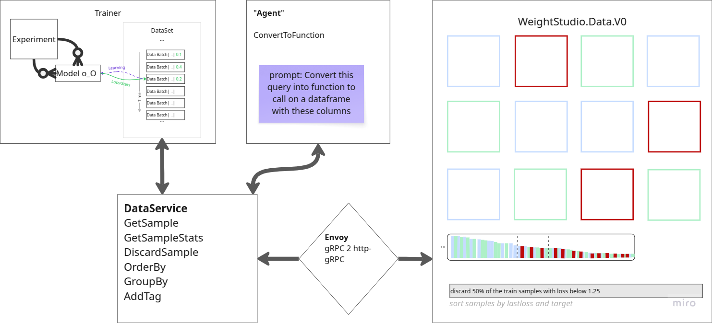

# WeightsLab UX

WeightsLab UX is the on-premise, data-facing frontend for the WeightsLab machine learning framework. It is a TypeScript-based application designed for visualizing datasets and interacting with ML experiments.

## Overview

This application serves as the primary user interface for exploring data, order, group, add slices and discard samples that are deemed unnecessary.



## Tech Stack

- **TypeScript**: Core language for development.
- **Vite**: Frontend tooling for development and builds.
- **Protocol Buffers / gRPC-web**: For type-safe API communication with the backend.


## Getting Started

### Prerequisites

- **Python 3.11**
- **Docker**

### Installation & Setup

Follow these steps to set up the environment for both `weightslab` (backend) and `weights_studio` (frontend).

**Python**
1. **Create and activate a virtual environment** (Python 3.11 required):
   ```bash
   # In the root of the repository
   python3.11 -m venv venv
   source venv/bin/activate
   ```

2. **Install Backend Dependencies**:
   Navigate to the `weightslab` directory.
   ```bash
   cd weightslab
   pip install -r requirements.txt
   ```

3. **Install `weightslab` package in Editable Mode**:
   This allows the backend scripts to import `weightslab` modules.
   ```bash
   pip install --no-deps -e .
   ```
4. (**Developper/Optional**) - **Generate Protocol Buffers**:

   Only if *.js files are not generated in ../src. Navigate to the `weights_studio` directory and run the generation script. This generates both Python (backend) and TypeScript (frontend) proto files.
   ```bash
   cd ../weights_studio/start
   ./generate_typescript_protos.sh
   ```

**Deploy Weights_Studio**
1. **Set Env. Variables**:
   ```bash
   cd docker/
   # for Ubuntu & Mac OS
   ./source-env.sh
   # for Windows
   ./source-env.ps1
   ```

2. **Deploy Docker Services**
   ```bash
   cd ./docker
   docker compose up -d weights_studio
   ```

### Checklist to see if it works
- Check Envoy administration page is reachable: http://localhost:9091/
- Check OLLAMA is reachable: http://localhost:1135/
- Check if Weights Studio page is reachable: http://localhost:5173/


### Usage
Access the UI at `http://localhost:5173`.

**1. Start the Backend (Trainer Service)**
Run your training script which hosts the service.
```bash
# Ensure venv is activated
# Example:
python ../../weightslab/examples/torch_mnist_training/mnist_training.py
```